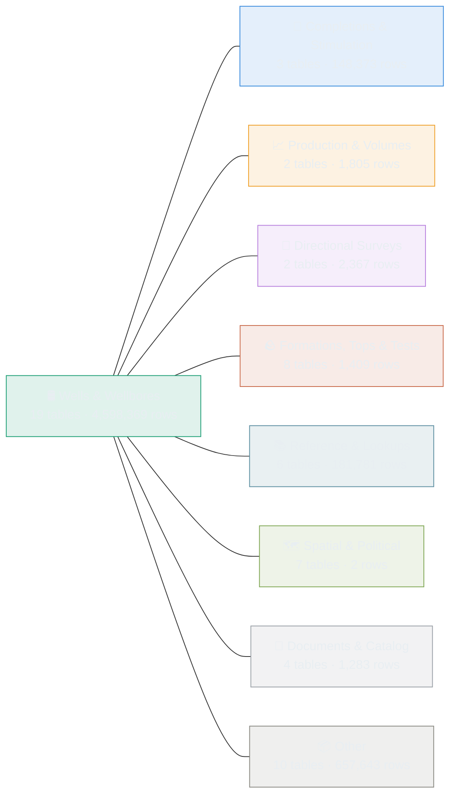
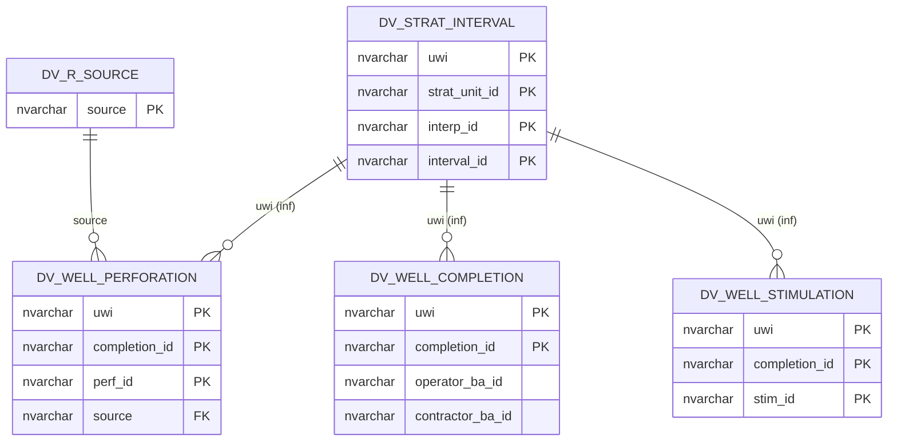
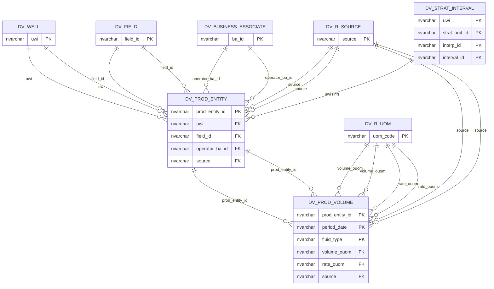
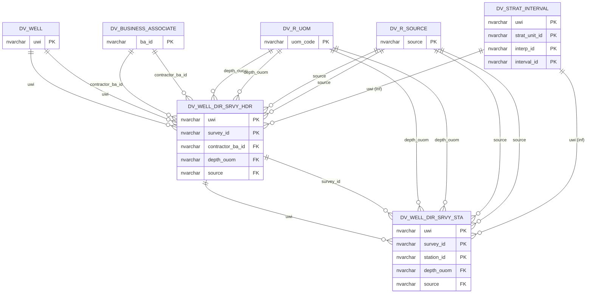
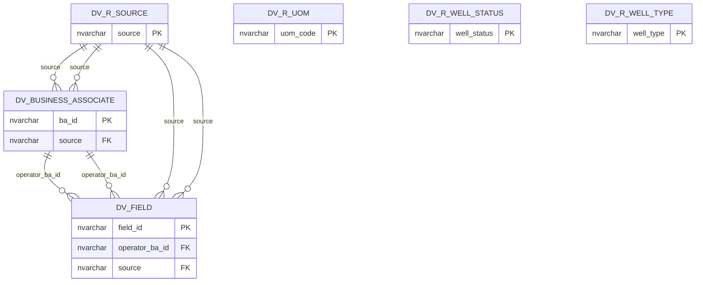
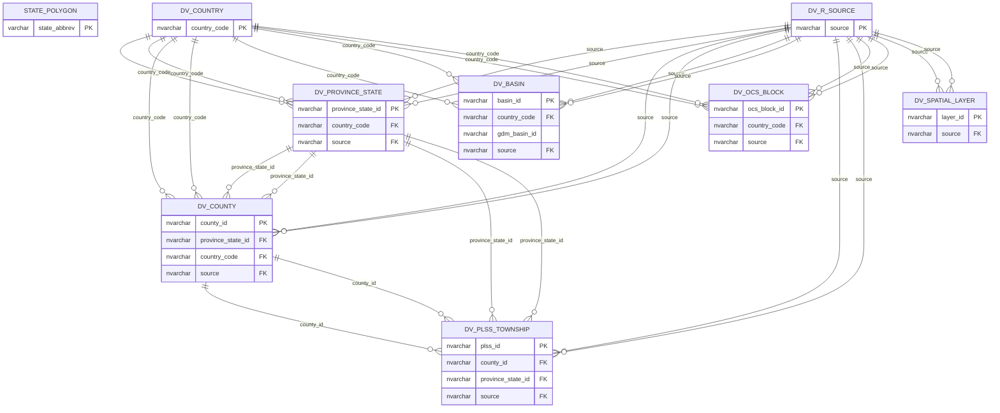
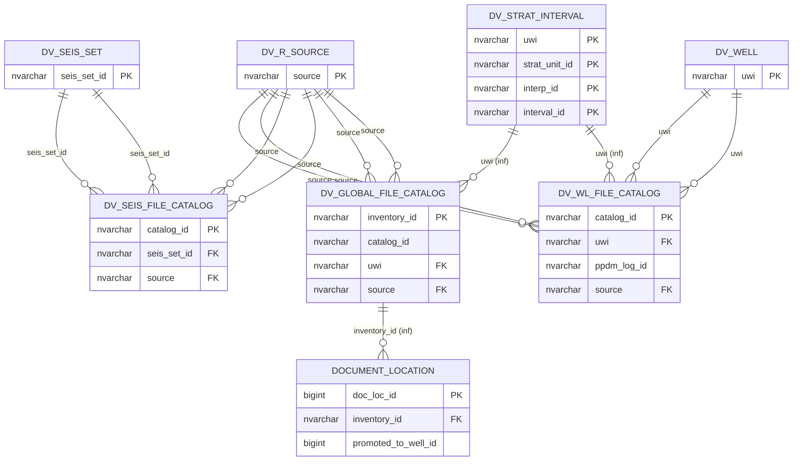

# dataview — schema map

_Generated 2026-06-14 11:35 from the live catalog._

## Subject areas

## 🛢 Wells & Wellbores

Core well identity plus the per-source federation extension tables. Everything in the model hangs off the UWI.

*19 tables.*

```mermaid
erDiagram
    DV_STG_WELL {
        int _stg_row_id PK
        nvarchar UWI FK
    }
    DV_WELL {
        nvarchar uwi PK
        nvarchar operator_ba_id
        nvarchar field_id FK
        nvarchar current_operator_ba_id
        nvarchar original_operator_ba_id
    }
    DV_WELL_ALIAS {
        nvarchar uwi PK
        nvarchar alias_id PK
        nvarchar source FK
    }
    DV_WELL_BACKUP_20260524 {
        nvarchar uwi FK
        nvarchar operator_ba_id
        nvarchar field_id FK
        nvarchar current_operator_ba_id
        nvarchar original_operator_ba_id
    }
    DV_WELL_CASING {
        nvarchar uwi PK
        nvarchar casing_id PK
        nvarchar source FK
    }
    DV_WELL_EXT_KGS {
        nvarchar uwi PK
        nvarchar OIL_DOR_ID
        nvarchar GAS_DOR_ID
    }
    DV_WELL_EXT_MICHIGAN_WELLS {
        nvarchar uwi FK
    }
    DV_WELL_EXT_WY_WOGCC {
        nvarchar uwi FK
    }
    DV_WELL_EXTENSION {
        nvarchar uwi PK
        nvarchar attr_name PK
        nvarchar source PK
    }
    DV_WELL_GOM_BACKUP {
        nvarchar uwi FK
        nvarchar operator_ba_id
        nvarchar field_id FK
        nvarchar current_operator_ba_id
        nvarchar original_operator_ba_id
    }
    DV_WELL_IDENTIFIER {
        uniqueidentifier well_id PK
        nvarchar identifier_type PK
    }
    DV_WELL_LEGAL {
        nvarchar uwi PK
        nvarchar location_type PK
    }
    DV_WELL_LOG {
        nvarchar uwi PK
        nvarchar log_id PK
        nvarchar service_company_ba_id FK
        nvarchar depth_ouom FK
        nvarchar catalog_id
        nvarchar source FK
    }
    DV_WELL_LOG_CURVE {
        nvarchar uwi PK
        nvarchar log_id PK
        nvarchar curve_id PK
        nvarchar curve_unit FK
        nvarchar depth_ouom FK
        nvarchar source FK
    }
    DV_WELL_MUD_LOG {
        nvarchar uwi PK
        nvarchar mud_log_id PK
        nvarchar contractor_ba_id
        nvarchar catalog_id
        nvarchar source FK
        nvarchar mud_logger_ba_id
    }
    DV_WELL_PETRO_INTERP {
        nvarchar uwi PK
        nvarchar interp_id PK
        nvarchar analyst_ba_id
        nvarchar gr_log_id
        nvarchar res_log_id
        nvarchar density_log_id
        nvarchar neutron_log_id
        nvarchar sonic_log_id
        nvarchar source FK
    }
    DV_WELL_PRESSURE {
        nvarchar uwi PK
        nvarchar pressure_id PK
        nvarchar contractor_ba_id
        nvarchar source FK
    }
    DV_WELL_SHOWS {
        nvarchar uwi PK
        nvarchar mud_log_id PK
        nvarchar show_id PK
        nvarchar source FK
    }
    STG_AI_WELL {
        nvarchar uwi FK
    }
    DV_BUSINESS_ASSOCIATE {
        nvarchar ba_id PK
    }
    DV_FIELD {
        nvarchar field_id PK
    }
    DV_R_SOURCE {
        nvarchar source PK
    }
    DV_R_UOM {
        nvarchar uom_code PK
    }
    DV_STRAT_INTERVAL {
        nvarchar uwi PK
        nvarchar strat_unit_id PK
        nvarchar interp_id PK
        nvarchar interval_id PK
    }
    DV_WELL ||--o{ DV_WELL_ALIAS : "uwi"
    DV_WELL ||--o{ DV_WELL_ALIAS : "uwi"
    DV_R_SOURCE ||--o{ DV_WELL_ALIAS : "source"
    DV_R_SOURCE ||--o{ DV_WELL_ALIAS : "source"
    DV_WELL ||--o{ DV_WELL_PETRO_INTERP : "uwi"
    DV_R_SOURCE ||--o{ DV_WELL_PETRO_INTERP : "source"
    DV_WELL ||--o{ DV_WELL_PRESSURE : "uwi"
    DV_R_SOURCE ||--o{ DV_WELL_PRESSURE : "source"
    DV_WELL ||--o{ DV_WELL_LOG : "uwi"
    DV_WELL ||--o{ DV_WELL_LOG : "uwi"
    DV_BUSINESS_ASSOCIATE ||--o{ DV_WELL_LOG : "service_company_ba_id"
    DV_BUSINESS_ASSOCIATE ||--o{ DV_WELL_LOG : "service_company_ba_id"
    DV_R_UOM ||--o{ DV_WELL_LOG : "depth_ouom"
    DV_R_UOM ||--o{ DV_WELL_LOG : "depth_ouom"
    DV_R_SOURCE ||--o{ DV_WELL_LOG : "source"
    DV_R_SOURCE ||--o{ DV_WELL_LOG : "source"
    DV_WELL_LOG ||--o{ DV_WELL_LOG_CURVE : "uwi"
    DV_WELL_LOG ||--o{ DV_WELL_LOG_CURVE : "log_id"
    DV_R_UOM ||--o{ DV_WELL_LOG_CURVE : "curve_unit"
    DV_R_UOM ||--o{ DV_WELL_LOG_CURVE : "curve_unit"
    DV_R_UOM ||--o{ DV_WELL_LOG_CURVE : "depth_ouom"
    DV_R_UOM ||--o{ DV_WELL_LOG_CURVE : "depth_ouom"
    DV_R_SOURCE ||--o{ DV_WELL_LOG_CURVE : "source"
    DV_R_SOURCE ||--o{ DV_WELL_LOG_CURVE : "source"
    DV_WELL ||--o{ DV_WELL_LEGAL : "uwi"
    DV_WELL ||--o{ DV_WELL_EXTENSION : "uwi"
    DV_WELL ||--o{ DV_WELL_CASING : "uwi"
    DV_R_SOURCE ||--o{ DV_WELL_CASING : "source"
    DV_WELL ||--o{ DV_WELL_MUD_LOG : "uwi"
    DV_R_SOURCE ||--o{ DV_WELL_MUD_LOG : "source"
    DV_WELL_MUD_LOG ||--o{ DV_WELL_SHOWS : "uwi"
    DV_WELL_MUD_LOG ||--o{ DV_WELL_SHOWS : "mud_log_id"
    DV_R_SOURCE ||--o{ DV_WELL_SHOWS : "source"
    DV_STRAT_INTERVAL ||--o{ DV_STG_WELL : "uwi (inf)"
    DV_STRAT_INTERVAL ||--o{ DV_WELL : "uwi (inf)"
    DV_FIELD ||--o{ DV_WELL : "field_id (inf)"
    DV_STRAT_INTERVAL ||--o{ DV_WELL_ALIAS : "uwi (inf)"
    DV_STRAT_INTERVAL ||--o{ DV_WELL_BACKUP_20260524 : "uwi (inf)"
    DV_FIELD ||--o{ DV_WELL_BACKUP_20260524 : "field_id (inf)"
    DV_STRAT_INTERVAL ||--o{ DV_WELL_CASING : "uwi (inf)"
    DV_STRAT_INTERVAL ||--o{ DV_WELL_EXT_KGS : "uwi (inf)"
    DV_STRAT_INTERVAL ||--o{ DV_WELL_EXT_MICHIGAN_WELLS : "uwi (inf)"
    DV_STRAT_INTERVAL ||--o{ DV_WELL_EXT_WY_WOGCC : "uwi (inf)"
    DV_STRAT_INTERVAL ||--o{ DV_WELL_EXTENSION : "uwi (inf)"
    DV_STRAT_INTERVAL ||--o{ DV_WELL_GOM_BACKUP : "uwi (inf)"
    DV_FIELD ||--o{ DV_WELL_GOM_BACKUP : "field_id (inf)"
    DV_STRAT_INTERVAL ||--o{ DV_WELL_LEGAL : "uwi (inf)"
    DV_STRAT_INTERVAL ||--o{ DV_WELL_LOG : "uwi (inf)"
    DV_STRAT_INTERVAL ||--o{ DV_WELL_LOG_CURVE : "uwi (inf)"
    DV_STRAT_INTERVAL ||--o{ DV_WELL_MUD_LOG : "uwi (inf)"
    DV_STRAT_INTERVAL ||--o{ DV_WELL_PETRO_INTERP : "uwi (inf)"
    DV_STRAT_INTERVAL ||--o{ DV_WELL_PRESSURE : "uwi (inf)"
    DV_STRAT_INTERVAL ||--o{ DV_WELL_SHOWS : "uwi (inf)"
    DV_STRAT_INTERVAL ||--o{ STG_AI_WELL : "uwi (inf)"
```

## 🔧 Completions & Stimulation

Completion intervals, perforations, and stimulation / frac treatments tied back to the well.

*3 tables.*

## 📈 Production & Volumes

Monthly oil / gas / water volumes joined through the well and completion.

*2 tables.*

## 🧭 Directional Surveys

Deviation survey stations — measured depth, inclination, azimuth, and TVD per wellbore.

*2 tables.*

## 🪨 Formations, Tops & Tests

Formation tops / markers, drill-stem test intervals, and core data.

*8 tables.*

```mermaid
erDiagram
    DV_STRAT_INTERVAL {
        nvarchar uwi PK
        nvarchar strat_unit_id PK
        nvarchar interp_id PK
        nvarchar interval_id PK
        nvarchar depth_ouom FK
        nvarchar perm_ouom FK
        nvarchar source FK
    }
    DV_WELL_CORE {
        nvarchar uwi PK
        nvarchar core_id PK
        nvarchar cutting_company_ba_id
        nvarchar analysis_company_ba_id
        nvarchar source FK
    }
    DV_WELL_CORE_PHOTO {
        nvarchar uwi PK
        nvarchar core_id PK
        nvarchar photo_id PK
        nvarchar sample_id
        nvarchar catalog_id
        nvarchar source FK
    }
    DV_WELL_CORE_SAMPLE {
        nvarchar uwi PK
        nvarchar core_id PK
        nvarchar sample_id PK
        nvarchar source FK
    }
    DV_WELL_DST {
        nvarchar uwi PK
        nvarchar dst_id PK
        nvarchar contractor_ba_id
        nvarchar source FK
    }
    DV_WELL_DST_PERIOD {
        nvarchar uwi PK
        nvarchar dst_id PK
        nvarchar period_id PK
        nvarchar source FK
    }
    DV_WELL_FORMATION_TOP {
        nvarchar uwi PK
        nvarchar strat_unit_id PK
        nvarchar interp_id PK
        nvarchar depth_ouom FK
        nvarchar interpreter_ba_id FK
        nvarchar source FK
    }
    DV_WELL_PETRO_ZONE {
        nvarchar uwi PK
        nvarchar interp_id PK
        nvarchar zone_id PK
        nvarchar strat_unit_id
        nvarchar strat_interp_id
        nvarchar source FK
    }
    DV_BUSINESS_ASSOCIATE {
        nvarchar ba_id PK
    }
    DV_R_SOURCE {
        nvarchar source PK
    }
    DV_R_UOM {
        nvarchar uom_code PK
    }
    DV_WELL {
        nvarchar uwi PK
    }
    DV_WELL_PETRO_INTERP {
        nvarchar uwi PK
        nvarchar interp_id PK
    }
    DV_WELL_PETRO_INTERP ||--o{ DV_WELL_PETRO_ZONE : "uwi"
    DV_WELL_PETRO_INTERP ||--o{ DV_WELL_PETRO_ZONE : "interp_id"
    DV_R_SOURCE ||--o{ DV_WELL_PETRO_ZONE : "source"
    DV_WELL ||--o{ DV_WELL_FORMATION_TOP : "uwi"
    DV_WELL ||--o{ DV_WELL_FORMATION_TOP : "uwi"
    DV_R_UOM ||--o{ DV_WELL_FORMATION_TOP : "depth_ouom"
    DV_R_UOM ||--o{ DV_WELL_FORMATION_TOP : "depth_ouom"
    DV_BUSINESS_ASSOCIATE ||--o{ DV_WELL_FORMATION_TOP : "interpreter_ba_id"
    DV_BUSINESS_ASSOCIATE ||--o{ DV_WELL_FORMATION_TOP : "interpreter_ba_id"
    DV_R_SOURCE ||--o{ DV_WELL_FORMATION_TOP : "source"
    DV_R_SOURCE ||--o{ DV_WELL_FORMATION_TOP : "source"
    DV_WELL_FORMATION_TOP ||--o{ DV_STRAT_INTERVAL : "uwi"
    DV_WELL_FORMATION_TOP ||--o{ DV_STRAT_INTERVAL : "strat_unit_id"
    DV_WELL_FORMATION_TOP ||--o{ DV_STRAT_INTERVAL : "interp_id"
    DV_R_UOM ||--o{ DV_STRAT_INTERVAL : "depth_ouom"
    DV_R_UOM ||--o{ DV_STRAT_INTERVAL : "depth_ouom"
    DV_R_UOM ||--o{ DV_STRAT_INTERVAL : "perm_ouom"
    DV_R_UOM ||--o{ DV_STRAT_INTERVAL : "perm_ouom"
    DV_R_SOURCE ||--o{ DV_STRAT_INTERVAL : "source"
    DV_R_SOURCE ||--o{ DV_STRAT_INTERVAL : "source"
    DV_WELL ||--o{ DV_WELL_CORE : "uwi"
    DV_R_SOURCE ||--o{ DV_WELL_CORE : "source"
    DV_WELL_CORE ||--o{ DV_WELL_CORE_SAMPLE : "uwi"
    DV_WELL_CORE ||--o{ DV_WELL_CORE_SAMPLE : "core_id"
    DV_R_SOURCE ||--o{ DV_WELL_CORE_SAMPLE : "source"
    DV_WELL_CORE ||--o{ DV_WELL_CORE_PHOTO : "uwi"
    DV_WELL_CORE ||--o{ DV_WELL_CORE_PHOTO : "core_id"
    DV_R_SOURCE ||--o{ DV_WELL_CORE_PHOTO : "source"
    DV_WELL ||--o{ DV_WELL_DST : "uwi"
    DV_R_SOURCE ||--o{ DV_WELL_DST : "source"
    DV_WELL_DST ||--o{ DV_WELL_DST_PERIOD : "uwi"
    DV_WELL_DST ||--o{ DV_WELL_DST_PERIOD : "dst_id"
    DV_R_SOURCE ||--o{ DV_WELL_DST_PERIOD : "source"
    DV_STRAT_INTERVAL ||--o{ DV_WELL_CORE : "uwi (inf)"
    DV_STRAT_INTERVAL ||--o{ DV_WELL_CORE_PHOTO : "uwi (inf)"
    DV_STRAT_INTERVAL ||--o{ DV_WELL_CORE_SAMPLE : "uwi (inf)"
    DV_STRAT_INTERVAL ||--o{ DV_WELL_DST : "uwi (inf)"
    DV_STRAT_INTERVAL ||--o{ DV_WELL_DST_PERIOD : "uwi (inf)"
    DV_STRAT_INTERVAL ||--o{ DV_WELL_FORMATION_TOP : "uwi (inf)"
    DV_STRAT_INTERVAL ||--o{ DV_WELL_PETRO_ZONE : "uwi (inf)"
```

## 📚 Reference & Lookups

Business associates, fields, units, and PPDM reference / standard values that the data tables point at.

*6 tables.*

## 🗺 Spatial & Political

County / state / PLSS / census boundaries, basins and plays, and BOEM lease blocks.

*7 tables.*

## 📁 Documents & Catalog

File inventory, catalog scoring, scout tickets, and the LAS / PDF source assets.

*4 tables.*

## 📦 Other

Tables not yet classified into a subject area — adjust the rules or supply an overrides file to reclassify.

*10 tables.*

```mermaid
erDiagram
    _STG_KGS_H3_BACKFILL {
        nvarchar uwi FK
        nvarchar operator_ba_id
        nvarchar field_id FK
        nvarchar current_operator_ba_id
        nvarchar original_operator_ba_id
    }
    DV_COLUMN_MAP {
        nvarchar map_id PK
        nvarchar source FK
    }
    DV_COUNTRY {
        nvarchar country_code PK
        nvarchar source FK
    }
    DV_DATA_QUALITY {
        nvarchar dq_id PK
        nvarchar entity_id FK
        nvarchar batch_id FK
        nvarchar source FK
    }
    DV_LOAD_BATCH {
        nvarchar batch_id PK
        nvarchar operator_ba_id FK
        nvarchar source FK
    }
    DV_MAP_AREA {
        nvarchar area_id PK
    }
    DV_SEIS_LINE {
        nvarchar seis_set_id PK
        nvarchar line_id PK
        nvarchar source FK
    }
    DV_SEIS_SET {
        nvarchar seis_set_id PK
        nvarchar contractor_ba_id FK
        nvarchar operator_ba_id FK
        nvarchar catalog_id
        nvarchar source FK
    }
    DV_SOURCE {
        nvarchar source PK
        nvarchar source_ref FK
    }
    STG_AI_EXT {
        nvarchar uwi FK
    }
    DV_BUSINESS_ASSOCIATE {
        nvarchar ba_id PK
    }
    DV_FIELD {
        nvarchar field_id PK
    }
    DV_PROD_ENTITY {
        nvarchar prod_entity_id PK
    }
    DV_R_SOURCE {
        nvarchar source PK
    }
    DV_STRAT_INTERVAL {
        nvarchar uwi PK
        nvarchar strat_unit_id PK
        nvarchar interp_id PK
        nvarchar interval_id PK
    }
    DV_R_SOURCE ||--o{ DV_COLUMN_MAP : "source"
    DV_R_SOURCE ||--o{ DV_COLUMN_MAP : "source"
    DV_LOAD_BATCH ||--o{ DV_DATA_QUALITY : "batch_id"
    DV_LOAD_BATCH ||--o{ DV_DATA_QUALITY : "batch_id"
    DV_R_SOURCE ||--o{ DV_DATA_QUALITY : "source"
    DV_R_SOURCE ||--o{ DV_DATA_QUALITY : "source"
    DV_R_SOURCE ||--o{ DV_COUNTRY : "source"
    DV_R_SOURCE ||--o{ DV_COUNTRY : "source"
    DV_BUSINESS_ASSOCIATE ||--o{ DV_SEIS_SET : "contractor_ba_id"
    DV_BUSINESS_ASSOCIATE ||--o{ DV_SEIS_SET : "contractor_ba_id"
    DV_BUSINESS_ASSOCIATE ||--o{ DV_SEIS_SET : "operator_ba_id"
    DV_BUSINESS_ASSOCIATE ||--o{ DV_SEIS_SET : "operator_ba_id"
    DV_R_SOURCE ||--o{ DV_SEIS_SET : "source"
    DV_R_SOURCE ||--o{ DV_SEIS_SET : "source"
    DV_SEIS_SET ||--o{ DV_SEIS_LINE : "seis_set_id"
    DV_SEIS_SET ||--o{ DV_SEIS_LINE : "seis_set_id"
    DV_R_SOURCE ||--o{ DV_SEIS_LINE : "source"
    DV_R_SOURCE ||--o{ DV_SEIS_LINE : "source"
    DV_R_SOURCE ||--o{ DV_SOURCE : "source_ref"
    DV_R_SOURCE ||--o{ DV_SOURCE : "source_ref"
    DV_BUSINESS_ASSOCIATE ||--o{ DV_LOAD_BATCH : "operator_ba_id"
    DV_BUSINESS_ASSOCIATE ||--o{ DV_LOAD_BATCH : "operator_ba_id"
    DV_R_SOURCE ||--o{ DV_LOAD_BATCH : "source"
    DV_R_SOURCE ||--o{ DV_LOAD_BATCH : "source"
    DV_STRAT_INTERVAL ||--o{ _STG_KGS_H3_BACKFILL : "uwi (inf)"
    DV_FIELD ||--o{ _STG_KGS_H3_BACKFILL : "field_id (inf)"
    DV_PROD_ENTITY ||--o{ DV_DATA_QUALITY : "entity_id (inf)"
    DV_STRAT_INTERVAL ||--o{ STG_AI_EXT : "uwi (inf)"
```

