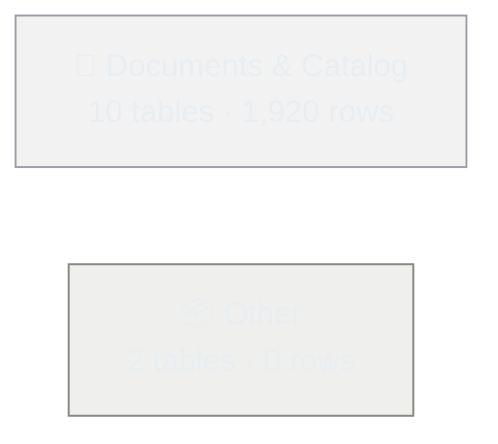
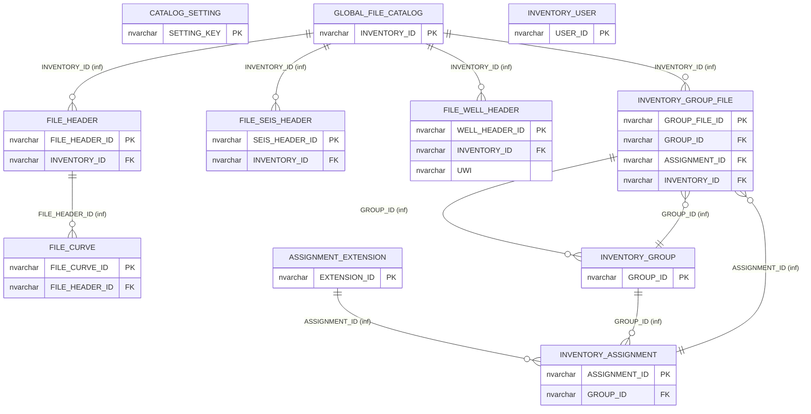
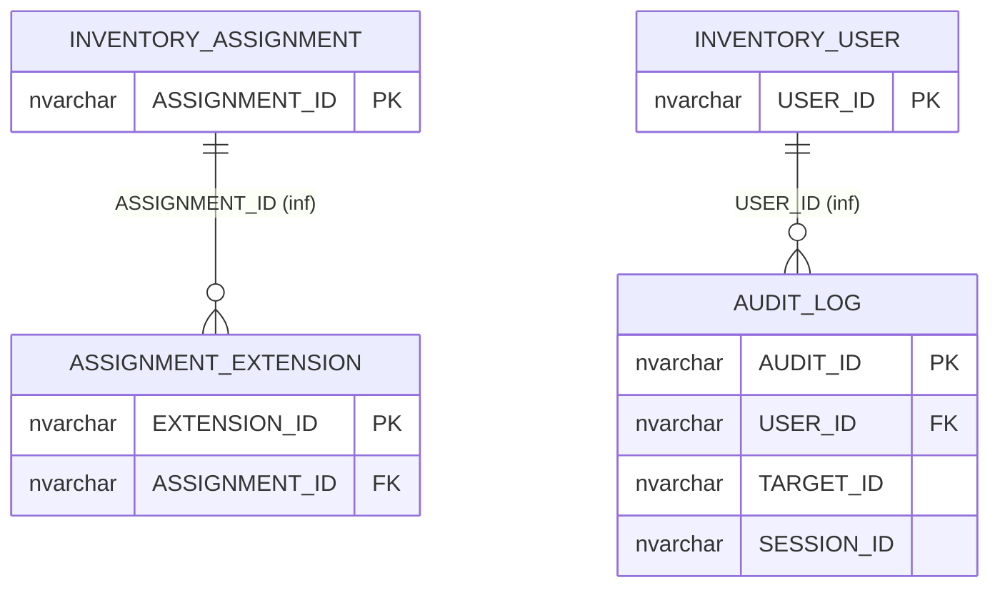

# file_catalog — schema map

_Generated 2026-06-14 11:35 from the live catalog._

## Subject areas

## 📁 Documents & Catalog

File inventory, catalog scoring, scout tickets, and the LAS / PDF source assets.

*10 tables.*

## 📦 Other

Tables not yet classified into a subject area — adjust the rules or supply an overrides file to reclassify.

*2 tables.*

